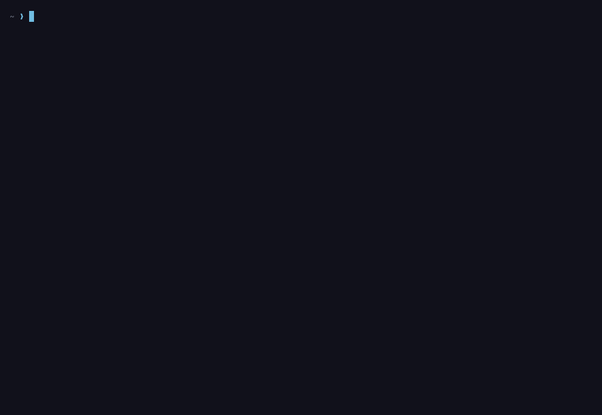

# toktape

**로컬 LLM 서빙을 위한 블랙박스 테이프.**

[English](README.md) · 한국어 · [日本語](README.ja.md)

[](https://github.com/midagedev/toktape/actions/workflows/ci.yml)
[](https://github.com/midagedev/toktape/releases/latest)
[](go.mod)
[](LICENSE)


toktape는 이미 떠 있는 llama-server에 붙어서 한 번의 실행을 `.toktape` 파일로
녹화하고, 카드 한 장을 출력합니다. 모델이 어디에 올라가 있는지, 프로세스가
실제로 무엇을 건드렸는지, 요청이 정말 얼마나 빨랐는지가 그 한 장에 담깁니다.
스트림 하나든 동시에 여덟이든 같은 방식으로 기록합니다.

<p align="center"></p>

<p align="center"><em>연출이 아니라 실제 실행입니다. Qwen3.6-35B-A3B UD-Q6_K, 27.3 GiB짜리 희소 MoE를 RTX A6000 한 장에 통째로 올렸습니다. 프롬프트에 명령을 치고, 서버를 찾아 붙고, 네 스트림이 서로 다른 코드 리뷰 질문에 각각 42.1 tok/s로 동시에 답하고, 결과가 나옵니다. 각 스트림은 모델이 할 말을 마친 지점에서 멈춥니다. 152토큰에서 279토큰 사이이고, 토큰 상한에 잘린 스트림은 없습니다. 카드의 집계치 144 tok/s가 42.1의 네 배가 아닌 것도 같은 이유입니다. 집계는 디코딩 구간 전체를 재는데, 그 구간의 마지막 2초에는 스트림이 하나만 남아 있습니다. 클립은 첫 토큰 3초 전부터 시작합니다(<code>--prefill-lead 3s</code>). 프리필을 기다린 나머지 시간은 테이프와, 클립이 열릴 때 화면에 이미 올라가 있는 시계에 남아 있습니다. 보이는 것은 전부 1:1입니다. 화면 녹화가 아니라 <code>assets/hero.tape</code>를 <code>toktape render</code>와 같은 렌더러로 다시 그린 것이고, 아래 카드는 같은 파일에서 <code>toktape card assets/hero.tape</code>로 나옵니다.</em></p>

```text
┌──────────────────────────────────────────────────────────────────────┐
│ toktape v0.2.4               20260917-144056-qwen3-6-35b-a3b-ud-q6-k │
├──────────────────────────────────────────────────────────────────────┤
│ MODEL    Qwen3.6-35B-A3B-UD-Q6_K.gguf · UD-Q6_K · 27.3 GiB           │
│ ENGINE   ik_llama.cpp c10fbbcc · linux 6.8.0-139-generic             │
│          workstation                                                 │
│ RIG      RTX A6000 48G · AMD Ryzen Threadripper PRO 5975WX 32-Cores  │
│          252 GB DDR4-3600                                            │
├──────────────────────────────────────────────────────────────────────┤
│ Decode        144 tok/s aggregate · 42.1 tok/s each                  │
│               ≈ 125–230 GB/s, 16–30% of peak                         │
│ Prefill       167 tok/s aggregate · 42.1 tok/s each                  │
│               238 prompt tokens · engine prefill 5649 ms             │
│               queue 56 ms                                            │
│ Context       8192 (238 in / 214 out)                                │
│ Prefix cache  0% hit (0/238) · warm                                  │
│ Sampling      greedy (temp 0) · thinking off · chat                  │
│ Streams       4 streams · not all decoding at once                   │
│               TTFT p50 5704 ms p95 5707 ms · slots busy max ?        │
├──────────────────────────────────────────────────────────────────────┤
│ MEMORY   GPU0 [██████░░░░] 28.5/48.0 GiB                             │
│          weights 26.8 | kv ? | compute ? GiB                         │
│          Host placed 0.5 GiB (all in RAM)                            │
│          Host RSS 1.9 GiB (file 0.7 / anon 1.1)                      │
│          Page faults 0.0 maj/token (0 during decode)                 │
├──────────────────────────────────────────────────────────────────────┤
│ HOST     GPU0 68°C 281 of 300 W · throttled: no · contended: no      │
├──────────────────────────────────────────────────────────────────────┤
│ FLAGS    -ngl 99 -fa on -b 2048 -ub 512 -ctk default -ctv default    │
│          -t 32                                                       │
│          -m /models/Qwen3.6-35B-A3B/Qwen3.6-35B-A3B-UD-Q6_K.gguf     │
│          -c 32768 --jinja -np 4 --jinja --host 127.0.0.1 --port 8012 │
├──────────────────────────────────────────────────────────────────────┤
│ ! 2 caveats — ragged run: 4 × 42.1 is 168, not the 144 aggregate —   │
│   the run had a tail on fewer streams, and this tape cannot say how  │
│   long it was · recorded                                             │
├──────────────────────────────────────────────────────────────────────┤
│                toktape · github.com/midagedev/toktape                │
└──────────────────────────────────────────────────────────────────────┘
```

## 왜 만들었나

"이 장비에서 이 모델이 몇 tok/s" 글은 늘 같은 댓글로 끝납니다. 프롬프트가
캐시된 건 아니냐, 플래시 어텐션은 켰냐, 동시 몇 스트림이냐, 양자화는 정확히
뭐냐, 그때 다른 프로세스는 안 돌았냐. toktape는 그 질문 전부를 서버가 직접
보고한 수치로 카드 한 장에 답하고, 실행 자체를 파일로 남깁니다. 누구든 같은
파일에서 같은 카드를 다시 그릴 수 있습니다. 정적 바이너리 하나, MIT 라이선스,
텔레메트리 없음, 계정 없음입니다.

## 설치

**Homebrew** (macOS·Linux 공통):

```sh
brew install midagedev/tap/toktape
```

**셸 스크립트.** OS와 CPU에 맞는 릴리스 아카이브를 받아 `checksums.txt`로
검증한 뒤 바이너리 하나를 `~/.local/bin`에 넣습니다.

```sh
curl -fsSL https://raw.githubusercontent.com/midagedev/toktape/main/scripts/install.sh | sh
```

설치 위치는 `TOKTAPE_INSTALL`, 버전 고정은 `TOKTAPE_VERSION`으로 바꿉니다.
GitHub에 나갈 수 없는 장비라면 `TOKTAPE_BASE_URL`에 미러나 `file://`
디렉터리를 지정하면 됩니다. `sh` 뒤에 `-s -- --dry-run`을 붙이면 실제로 설치하지
않고 무엇을 할지만 보여 줍니다.

**Windows.** 릴리스 페이지에 `toktape_<version>_windows_amd64.zip`과 arm64
zip이 함께 올라갑니다. `toktape.exe`를 풀어 `PATH`에 두면 됩니다. 위의 셸
스크립트는 POSIX 전용이라 이 zip은 받지 않습니다.

**Go:**

```sh
go install github.com/midagedev/toktape/cmd/toktape@latest
```

**소스 빌드** (Go 1.26, cgo 없음):

```sh
git clone https://github.com/midagedev/toktape.git
cd toktape
go build -o toktape ./cmd/toktape
```

`toktape version`으로 설치를 확인합니다. 실행 시 의존하는 것이 전혀 없는
바이너리라, 서버가 도는 장비로 `scp` 하는 것도 정식 설치 방법입니다.

**플랫폼.** Linux x86_64·arm64가 기본 대상입니다. 메모리, 페이지 폴트, 서버
플래그 행은 `/proc`에서 읽는데 이것은 서버가 도는 호스트에만 있습니다. macOS도
빌드되고 실행되며 `--url`로 원격 서버에 붙습니다. 이때 `/proc` 행은 `?`로
찍힙니다. Windows는 v0.2.5부터 자기 바이너리를 갖고, 보이는 것은 macOS와
같습니다. `/proc` 뷰까지 필요하면 WSL2에서 Linux 바이너리를 쓰면 됩니다.
GPU 행은 `nvidia-smi`에서 읽습니다.

## 바로 써 보기

llama-server가 도는 장비에서 한 단어만 칩니다.

```sh
toktape
```

1. **탐색** — `127.0.0.1:8080`, 이어서 `:8081`, `:8000`, `:5000`을 찔러
   `/props`에 답하는 첫 서버를 잡습니다.
2. **부착** — `/props`에서 모델 경로, 컨텍스트 크기, 슬롯 수를 읽고, 그 경로를
   `/proc/*/cmdline`과 대조해 서버 PID를 찾은 뒤 `/proc` 뷰를 엽니다.
3. **프롬프트** — 내장 프롬프트 세트(21개의 긴 아티팩트, 이 머신이 잰 프리필이
   감당할 만큼만 앞부분을 잘라 보냅니다)에서 요청 하나를 `timings_per_token`과
   `return_progress`를 켜서 보내고, 답이 스트리밍되는 동안 메이저 폴트, RSS,
   GPU 상태를 샘플링합니다.
4. **테이프** — 실행 전체를 `~/.toktape/runs/<id>.toktape`에 씁니다.
5. **카드** — 72칸 카드를 출력하고 테이프 옆에 저장한 뒤, 공유 방법을 한 줄로
   알려 줍니다.

포트도, PID도, 외워야 할 플래그도 없습니다. 모델이 아직 로딩 중이면 기다립니다
(`--wait`, 기본 10분).

**동시 여덟 스트림.** 에이전트 워크로드가 서버에 하는 일이 바로 이것입니다.

```sh
toktape --sessions 8
```

N이 늘면 스트림당 tok/s는 떨어지는 게 정상입니다. "이 장비가 에이전트 여덟을
감당하느냐"에 답하는 숫자는 합계이고, 단일 스트림 벤치마크로는 이 숫자를
볼 수 없습니다.

**실시간으로 보기.** 스트림마다 타일 하나, 오른쪽에 머신 패널입니다. 답변 안의
펜스 코드 블록은 도착하는 대로 모양이 잡힙니다. 키워드는 무게를 얻고 주석과
구두점은 한 단계 물러나서, 화면에 색을 하나도 더하지 않고도 코드가 코드로
읽힙니다.

```sh
toktape --sessions 4 --tui
toktape --sessions 8 --tui --grid 2x2     # four tiles per page, ←/→ to page
```

**공유하기:**

```sh
toktape card ~/.toktape/runs/<id>.toktape -o png          # 1200×675 image next to the tape
toktape card ~/.toktape/runs/<id>.toktape -o md --copy    # card + llama-bench table, on the clipboard
toktape render                                          # the newest run as a GIF
```

**다시 재생하기.** 라이브 화면에서 원하는 속도로 돌려 봅니다.

```sh
toktape play ~/.toktape/runs/<id>.toktape --speed 2
```

## 어떻게 측정하나

- **프리필은 머신의 속도와 고정 비용으로, 실행 전에 따로 잽니다.** 아무것도
  밀려들지 않은 상태에서 `/completion`에 날것 프롬프트 둘 — 128토큰짜리 하나와,
  짧은 쪽이 직접 보인 비용이 예산 안에서 허락하는 만큼 긴 하나 — 을 보내
  토큰당 속도와 요청당 고정 비용으로 피팅합니다. 고정 비용이 대부분인 프리필
  수치는 throughput이 아닌데, 어느 쪽이 어느 쪽인지 말하는 것이 이 피팅이고
  카드는 둘 다 싣습니다. 프로브 프롬프트는 실행마다 소금(salt)으로 시작하므로,
  같은 따뜻한 서버를 두 번 재도 측정이 됩니다. 프리픽스 캐시가 프로브에게
  공짜 점수를 준 적은 없습니다.
- **프롬프트 세트가 계측기입니다.** 실행은 당신이 친 프롬프트를 보내지
  않습니다. 고정 세트 21개 — 진짜 버그와 통과하는 테스트가 있는 코드, 쿼리
  플랜, 장애 타임라인, ADR, 한국어와 일본어 산문 — 를 보내고, 하나하나
  18–30 KB입니다. 어떤 장비도 통째로 보내면 안 되도록 일부러 그렇게 컸습니다.
  속도라는 것이 고정 비용이 차지하는 몫이 작아야 성립하니까요. 실행은 각
  프롬프트의 앞부분(prefix)을, 피팅이 말하는 몫 — 고정 비용이 프리필의
  스무분의 일 이하로 묶이는 — 만큼 잘라 보내고 몇 글자를 보냈는지 기록합니다.
  다르게 잘랐던 두 장비도 결국 같은 일을 했습니다. 올라간 기록은 세트와
  대조해 검증되고, 잘린 접두어까지 같이.
- **서버 수치가 기록이고, 클라이언트 수치는 검증입니다.** 요청에
  `timings_per_token`을 켜므로 청크마다 서버 자신의 `prompt_per_second`,
  `predicted_per_second`, 토큰 수가 옵니다. toktape는 자기 시계로 같은 속도를
  다시 계산해 둘 다 보관하고, 2 % 안에서 일치했는지를 테이프에 남깁니다.
  불일치를 더 보기 좋은 숫자를 골라서 덮는 일은 없습니다.
- **클라이언트 속도는 콘텐츠 구간에서 잽니다.** 텍스트를 실은 첫 토큰부터 마지막
  토큰까지의 간격이지, 요청 발송부터 소켓 종료까지의 벽시계 시간이 아닙니다.
- **생성 토큰 32개를 넘어야 "디코드"라고 부릅니다.** 그 아래는 카드에 `Sample`로
  적습니다.
- **리즈닝 토큰도 셉니다.** 씽킹 모델의 `reasoning_content` 델타는 디코드
  토큰으로 기록되고 라이브 화면에서 흐리게 표시됩니다. TTFT는 두 종류 중 먼저
  온 토큰입니다.
- **"아직 로드되지 않음"은 GGUF 텐서 헤더에서** 텐서 종류별로 읽습니다.
- **상주량은 기록이 아니라 파생입니다.** 호스트 배치 중 RAM에 있는 몫은 그
  순간 프로세스의 파일 기반 상주 집합입니다. `/proc`을 못 보면 0으로
  채우는 대신 분할 자체를 찍지 않습니다.
- **라운드 경계마다 기계의 증인을 남깁니다.** 로드 애버리지, IO 압력, 페이지
  캐시, 살아 있는 `llama-*` 프로세스, cpufreq 캡, hwmon 온도 하나. 실행 도중
  기계가 변했다면 그 수치는 애초에 한 가지 설정의 것이 아니었고, 카드가 그렇게
  말합니다.
- **PID가 없으면**(원격 서버, 들여다볼 수 없는 컨테이너) 속도, 프리픽스 캐시
  히트, GPU 상태는 그대로 기록됩니다. 호스트 RSS, 페이지 폴트, 플래그는 `?`로
  찍힙니다. **GPU가 없으면** VRAM과 온도 행이 `?`가 됩니다. 폴트를 측정하지
  못한 실행에는 cold 라벨을 붙이지 않습니다.
- 모르는 값은 `?`입니다. 카드는 관측하지 않은 값을 절대 보여 주지 않습니다.

## 인용할 가치가 있는 숫자

카드는 찍는 숫자마다 단서를 답니다. 아래 습관들이 단서가 거의 없는 카드를
만듭니다. 대부분 플래그 하나, 혹은 아무것도 아닙니다.

- **두 번 돌리고 두 번째를 인용하세요.** 막 로딩한 모델에 대한 첫 실행은
  디코드하는 동안 디스크에서 가중치를 끌어오고, 카드가 추측이 아니라 폴트
  수를 근거로 `cold`라고 적습니다. 인용할 가치가 있는 쪽은 warm 속도입니다.
  cold를 인용하려면 그렇다고 말하세요.
- **길이는 초로.** `--for 30s`. 같은 토큰 수는 기계마다 다른 시간을 뜻하고,
  그 시간이야말로 지금 재려던 것입니다. `--n-predict`를 직접 대는 순간 시계는
  꺼지므로, 상한을 댄 실행은 상한에 잘립니다.
- **추론 모델은 시계를 쓰며 생각합니다.** 생각 토큰도 디코드 토큰이라, 기본
  예산은 답이 시작되기도 전에 소진될 수 있습니다. 생각을 담으려면 `--for 60s`,
  추론 아닌 모델과의 동등 비교는 `--no-think`. 카드가 무엇을 측정했는지
  샘플링과 스위치로 적어 둡니다.
- **뭔가 인용하기 전에 caveats 줄을 읽으세요.** 모든 카드는 인용하면 안 될
  이유들로 끝나고 코드로 명시됩니다. `-o json`은 같은 목록에 심각도까지
  실어 보냅니다. 속도라 부르기엔 짧은 생성, 바쁜 머신, 시계에 잘림 — 전부
  글을 올리기 전에 카드에 먼저 있습니다.
- **같은 것끼리 비교하세요.** 프롬프트 세트 id, 샘플링, 엔드포인트, 엔진
  빌드가 전부 카드에 있습니다. 두 카드는 비교 가능하거나, 왜 아닌지
  말합니다.
- **질문만큼의 스트림 수.** `--sessions 8`은 에이전트 여덟이 서버에 하는
  일입니다 — 대기열, 슬롯 경합, 부하 아래의 합계. 단일 스트림은 다른 질문에
  답하고, N이 늘면 스트림당 tok/s가 떨어지는 것은 결함이 아니라 결과입니다.
- **장비를 가만히 두세요.** 컴파일 하나, 다른 벤치마크 하나이면 사람들이
  시험하는 대부분의 설정 차이보다 디코드가 더 흔들립니다. 증인은 라운드마다
  읽히고 바닥이 움직였으면 카드가 `contended` / `conditions_changed`라고
  말합니다.

## 카드에 담기는 것

모든 카드가 같은 자리에 같은 항목을 놓습니다. 두 장을 나란히 두고 읽을 수
있어야 하기 때문입니다. 각 항목은 논쟁 하나를 끝내기 위해 들어 있습니다.

- **이 숫자를 인용해도 되는지.** 위에 적은 caveats 줄이 그것입니다.
- **디코드와 프리필을 섞지 않습니다.** TTFT, 프롬프트 tok/s, 디코드 tok/s를
  각각 토큰 수와 함께, 그 옆에 머신의 프리필 피팅을 찍습니다. 동시 실행에서는
  빈 슬롯을 기다린 시간을 엔진이 실제로 한 일에서 떼어
  `engine prefill 10732 ms · queue 22 ms`로 적습니다. 줄을 선 시간이 느린
  모델로 읽히지 않도록.
- **프리픽스 캐시 히트.** `0% hit (0/512)` 또는 `78% hit (400/512)`. 시스템
  프롬프트가 한 글자만 달라도 캐시를 놓치고, 프리필이 이유 없이 열 배 느려지거나
  빨라져 보입니다.
- **cold / warm.** 디코드 중 실제로 발생한 메이저 폴트 수로 정하고, 추측은
  쓰지 않습니다.
- **토큰당 페이지 폴트.** "멈췄다가 다시 간다"를 설명하는 단 하나의 숫자입니다.
- **모델이 실제로 어디에 있나.** 호스트 RSS는 file/anon으로, VRAM은
  weights/KV/compute로 나누고, 로드되지 않은 바이트는 GGUF 텐서 헤더에서,
  그리고 놓인 것(placed)과 상주한 것(resident)의 차이를 적습니다.
  `-ot ... exps=CPU`는 호스트에 바이트를 놓지 RAM에 두지는 않으며, 카드가
  디코드 내내 디스크에서 다시 읽히는 만큼을 말합니다.
- **바이트가 실제로 건넌 버스에 대고 재는 대역폭.** VRAM과 호스트 RAM에 걸쳐
  놓인 모델에는 단일 대역폭이라는 것이 없습니다. 카드는 벽인 쪽을 지목해
  `≈ 115 GB/s from RAM per verify step, 99% of peak`라고 적고, 배치가 호스트의
  읽기량을 증명할 때만 비율을 붙입니다. 드래프트 모델이 있으면 바이트는
  verify step 단위로 세고, 그것이 버스가 실제로 본 단위입니다.
- **요청이 무엇을 물었는지.** 그리디, 서버 기본 샘플링, 생각하도록 내버려 둔
  추론 모델은 같은 엔진에서 11 %까지 벌어집니다.
  `Sampling  temp default · chat`이 이 속도가 그중 무엇에 속하는지 말하고,
  아무도 보내지 않은 temperature를 지어내지 않습니다.
- **드래프트가 있었다면.** `n_max 3 · 52% accepted (260/504)`와 그 수락률이
  만든 작업의 모양까지: `170 verify steps of 4.0 tokens`.
- **플래그 전부와 정확한 양자화.** `-ngl -fa -b -ub -ctk -ctv --load-mode -ot`.
  `UD-Q4_K_M`을 "Q4"로 줄이지 않습니다. 플래시 어텐션 여부와 배치 크기,
  이 둘이 빠지면 결과 글이 댓글 오십 개짜리 스레드가 됩니다.
- **contended.** 로드 애버리지와 다른 GPU 프로세스를 읽어 라벨을 붙입니다.
- **스트림.** TTFT p50·p95, 동시에 바빴던 최대 슬롯 수, 그리고 "스트림당 ×
  N이 정말 합계인가". 끝나는 시점이 어긋난 스트림들은 마지막 한 개만 남은
  구간까지 포함해 합계를 재게 되므로, 그 줄은 `4 streams · not all decoding
  at once`로 읽힙니다.

## 명령

| 동사 | 하는 일 | 예 |
| --- | --- | --- |
| `record` | 붙어서 실행을 녹화합니다. 기본 동사 | `toktape --sessions 4 --for 30s` |
| `card` | 테이프에서 카드를 다시 그립니다 | `toktape card <tape> -o png` |
| `play` | 라이브 화면에서 실행을 재생합니다 | `toktape play <tape> --speed 4` |
| `render` | GIF, mp4, asciicast, PNG 프레임으로 렌더합니다 | `toktape render <tape> --mp4 clip.mp4` |
| `ls` | 녹화된 실행 목록 | `toktape ls` |
| `log` | 모든 실행의 실험 장부 | `toktape log --sort decode` |
| `compare` | 두 실행의 지표와 플래그를 비교합니다 | `toktape compare a.toktape b.toktape` |
| `publish` | 실행을 올리고 링크를 찍습니다 | `toktape publish <tape>` |
| `profile` | 올릴 때마다 붙는 작성자 정보를 정합니다 | `toktape profile --name NAME --link URL --avatar FILE --bio TEXT` |
| `runs` | 올라간 실행 목록. 사이트와 같은 필터와 순서 | `toktape runs --gpu rtx-3090 --sort decode` |
| `show` | 올라간 실행 하나를 읽습니다. `--save`로 기록도 받습니다 | `toktape show <id> --save run.toktape` |
| `reindex` | 올라간 실행의 검색 행을 기록에서 다시 계산합니다. 새 toktape가 색인하는 수치가 옛 실행에도 붙습니다 | `toktape reindex <id>` |
| `version` | 버전 출력 | `toktape version` |

**녹화는 몇 초짜리인가.** 실행은 시계로 끝납니다. 기본 20초이고,
`--for 30s`처럼 원하는 길이를 직접 댈 수 있습니다. 이 질문에 토큰 수는
맞는 단위가 아닙니다 — 같은 256토큰이 빠른 GPU에 올린 7B에서는 2초가
안 되고, GPU 없이 도는 큰 모델에서는 2분이 넘습니다. 그래서 초를 대고,
`--n-predict`는 함께 걸리는 상한으로 남습니다. `--n-predict`를 직접 대는
것은 같은 질문에 대한 다른 답이라서, 대는 순간 시계는 꺼집니다. 정직하게
덧붙일 두 가지: 64토큰 아래로는 자르지 않습니다. 느린 기계는 요청한 것보다
오래 돌지언정 표본을 건네지 않습니다. 그리고 대개는 예산보다 모델이 먼저
멈춥니다. 그건 기계가 아니라 프롬프트가 하는 일입니다.

**record:** `--for DURATION`(기본 `20s`. `--for 0`이면 시계를 끕니다),
`--url`(기본은 자동 탐색), `--sessions N`(한 번에 보내는 스트림 수, 기본 1.
8을 넘기려면 `--max-sessions`에 같은 숫자를 한 번 더 적어야 하고, 서버 슬롯보다
많으면 거절합니다), `--prompt`(반복 가능, `--sessions`만큼 순환), `--prompts`(JSONL
파일. 한 줄이 `--sessions`개 스트림의 한 라운드이고, 순서대로 돌려 테이프 하나에
담습니다), `--spec-n-max LIST`(예: `3,5`. 프롬프트
묶음을 speculative `n_max` 값마다 한 번씩 돌려 한 테이프에 담고, 카드에는 값마다 한 줄이
붙습니다), `-n`/`--n-predict`(스트림당 토큰 상한. llama-bench의 `-n`과 같은 뜻이고,
대면 시계가 꺼집니다), `--out`(기본
`~/.toktape/runs`), `--tag`, `--note`, `--wait`, `--tui`,
`--grid COLSxROWS`(기본 `2x4`, `0`이면 터미널에 맞춤), `--no-card`,
`-o FORMAT`, `--quiet`.

**샘플링과 엔드포인트.** 요청을 어떤 모양으로 보내느냐는 서버를 어떤 플래그로
띄웠느냐만큼 수치를 움직입니다. 같은 추론 모델, 같은 프롬프트 20개, 같은 머신에서
raw 엔드포인트에 greedy로 보낸 쪽이 25.6 tok/s, 같은 엔드포인트에 서버 기본
샘플링이 24.5, 채팅 엔드포인트에 thinking을 켠 채로가 22.4였습니다. 그래서 `record`가
셋 다 이름을 붙입니다. `--temp N`은 샘플링 온도(`--temp 0`이 greedy이고, 지정하지
않으면 서버 자신의 기본값이 그대로 쓰입니다), `--no-think`는 엔진의
`enable_thinking` 스위치를 보내 추론 모델에게 생각하지 말라고 요청하고,
`--endpoint chat|completion`은 템플릿을 씌우는 채팅 경로와 프롬프트를 그대로
`/completion`에 던지는 경로 중 하나를 고르며, `--param key=value`(반복 가능)는 그
빌드가 받는 나머지를 그대로 실어 보냅니다 — `--param seed=7`, `--param top_k=40`,
`--param cache_prompt=false`. 값은 JSON으로 읽히면 JSON으로, 아니면 문자열로
보냅니다. `--no-think`는 채팅 쪽 설정입니다. thinking은 템플릿의 것이고 raw
프롬프트에는 템플릿이 없습니다. 보낸 것은 테이프에 그대로 남고 카드에 이름이 찍히니,
두 카드는 비교되거나 왜 비교할 수 없는지를 말합니다.

**출력 형식.** `-o FORMAT`(또는 `--output FORMAT`)은 llama-bench의 `-o`이고,
형식 이름도 llama-bench가 쓰는 말 그대로입니다. `record`와 `card`는 `json`(실행
요약), `jsonl`(같은 객체를 한 줄로. 여러 실행을 한 파일에 이어 붙일 수 있습니다),
`md`, 그리고 `csv`·`tsv`·`sql`(실행 하나를 장부의 한 행으로)을 찍고, `log`는 모든
실행을 같은 여섯 형식으로 찍습니다. `md`만은 llama-bench와 뜻이 다릅니다. 카드에서는
펜스 안의 카드, llama-bench 호환 표, Reproduce 블록이고, `log`에서는 장부를 옮긴
Markdown 표입니다. `sql`은 `runs` 테이블이 없으면 만들고 실행마다 한 행씩 넣으므로,
`toktape log -o sql | sqlite3 runs.db` 한 줄이면 데이터베이스가 됩니다. 동사가 받지
않는 형식을 주면 거절하고, 받는 형식을 알려 줍니다.

**card:** 위 형식에 더해 `-o png [FILE]`(1200×675 공유 이미지. 파일을 지정하지
않으면 테이프 옆에 씁니다), `--copy`(클립보드에도 복사. pbcopy·wl-copy·xclip이
있으면 그걸로, SSH 너머면 터미널로 OSC 52).

**render:** `--gif FILE`, `--mp4 FILE`(`PATH`에 ffmpeg 필요), `--cast FILE`
(asciicast v2), `--frames DIR`(PNG 시퀀스. GIF가 13 px 셀일 때 20 px 셀로 그리므로,
GIF와 똑같은 캔버스가 필요하면 `--font-size 13`을 주세요 — ✓ 줄마다 그린 픽셀
크기가 찍힙니다), `--duration`, `--fps`, `--size WxH`, `--open`(실행 앞에 셸 프롬프트에서 명령을 치는 장면을 붙입니다),
`--prefill-lead D`(실행의 처음이 아니라 첫 토큰 D초 전에서 클립을 시작해,
프리필을 기다린 나머지 시간을 클립 밖에 둡니다. 남은 프레임은 전부 그대로
1:1이고, 화면의 시계가 잘라낸 지점부터 시작하므로 별도 표시가 필요 없습니다).
여러 출력을 한 번에 지정하면 같은 프레임에서 함께 나옵니다. 테이프를 지정하지
않으면 가장 최근 실행을 씁니다.

**log:** `--sort`, `--model`, `--tag`, `--limit N`, `-o FORMAT`, `--rebuild`,
`--out`.

## 에이전트로 돌리기

toktape를 실제로 돌리는 쪽은 대개 사람이 아니라 Claude Code나 Codex입니다.
그 독자를 위한 페이지가 따로 있고([`docs/agents.md`](docs/agents.md)),
같은 계약이 `toktape help agents`로 바이너리 안에도 들어 있습니다. 누가
알려 주지 않아도 에이전트가 거기서 찾을 수 있게요. 측정 습관은
[인용할 가치가 있는 숫자](#인용할-가치가-있는-숫자)에 있고, 여기는 호출
규약만:

- **종료 코드로 분기하고, 메시지로 분기하지 마세요.** 모든 동사는 문서화된
  다섯 코드 중 하나로 끝나고, `-o json`은 성공이든 실패든 stdout에 객체 하나를
  찍습니다. 파싱 경로가 둘이 아니라 하나입니다.
- **타임아웃 안에 들어오는지는 플래그 두 개가 정합니다.** `--wait`의 기본은
  10분입니다. 450 GB 모델을 올리는 중인 서버는 기다릴 값어치가 있으니까요.
  생성 자체의 길이는 `--for`가 정합니다.
- **읽기는 공짜고 녹화는 아닙니다.** `toktape runs -o json`과 `toktape show
  <id> -o json`은 서버를 건드리지 않고 올라간 기록을 읽습니다. 동사 없는
  `toktape`는 녹화합니다.

## 실험 장부

실행마다 테이프 옆 `runs.tsv`에 한 행이 붙습니다. 파라미터 스윕이 카드
폴더가 아니라 표 하나가 됩니다. `--tag`와 `--note`로 실행에 라벨을 붙여 두면
둘 다 테이프에 저장되므로 장부는 언제든 다시 만들 수 있습니다.

```sh
toktape --tag ngl=40 --note "fa on"     # record, labelled
toktape log --sort decode                # which setting won
toktape log --tag ngl -o md              # paste into an issue
toktape log --rebuild                    # regenerate from the tapes
```

모르는 값은 터미널에서 `?`, 내보내기에서는 빈 칸, `-o sql`에서는 `NULL`입니다.
그래서 숫자 열이 숫자로 들어옵니다.

```sh
toktape log -o sql | sqlite3 runs.db
duckdb -c "select tag, decode_tok_s from read_csv('~/.toktape/runs/runs.tsv')"
```

## 클립

이 페이지 맨 위의 이미지는 화면 녹화가 아닙니다. 테이프를 프레임 단위로 다시
그린 것이고, 여러분의 테이프도 똑같이 렌더됩니다.

```sh
toktape render ~/.toktape/runs/<id>.toktape
toktape render ~/.toktape/runs/<id>.toktape --mp4 clip.mp4 --cast clip.cast
```

클립은 실행이 시작되는 화면에서 열리고, 실행 전체를 실제 속도로 재생한 뒤
결과에서 멈춥니다. 보고 있던 화면 위에 두 속도와 장비, 모델이 놓인 자리가
뜹니다. `--open`을 주면 이 페이지 맨 위의 클립처럼 명령을 치는 장면이 앞에
붙습니다.

클립 길이는 **녹화할 때** `--for`로 겨눕니다. 클립은 실행을 1:1로 재생한
것에 앞뒤 프레임 6초가 붙은 것이고 `--open`이면 12초라서, `--for 18s`면
30초짜리가 나옵니다. `render --duration`은 다른 플래그이고 대체재가 아닙니다.
그건 이미 가진 실행을 댄 길이에 욱여넣습니다. 그렇게 해 달라고 하지 않는 한
아무것도 압축하지 않습니다. 길이에 맞추려고 실행을 빨리 감은 클립은 이 페이지가
말하려는 바로 그 숫자를 속이는 것이니까요. 같은 테이프는 늘 같은 클립이 됩니다.

## 올리기

테이프는 통째로 건넬 만큼 작고(히어로가 25 KB), 테이프를 가진 페이지는 나머지를
전부 거기서 그려 낼 수 있습니다. [tape.midagedev.com](https://tape.midagedev.com)이
그렇게 동작합니다. `toktape publish`가 실행을 올리고 링크를 찍어 주는데, 그
링크 하나가 카드이고, 브라우저에서 다시 재생되는 실행이고, 트랜스크립트이고,
mp4이고, 기록 원본입니다.

```sh
toktape publish ~/.toktape/runs/<id>.toktape --dry-run
toktape publish ~/.toktape/runs/<id>.toktape
```

`--dry-run`은 올라갈 내용을 필드 하나하나 그대로 찍고, 아무것도 올리지
않습니다. 한 번은 읽어 두세요. 올린 실행은 기본으로 **공개**이고 **텍스트**
— 프롬프트와 모델이 쓴 답 — 를 **담습니다**. 어떤 텍스트로 잰 속도인지 모르면
반쪽 주장이니까요. 처음 실제로 올릴 때 그 점을 한 번 확인받습니다.
`--private`는 검색에서 빼고(링크는 그대로 열리고, 그 링크가 유일한 입구),
`--no-text`는 프롬프트와 답 없이 올립니다. 둘 다 `~/.toktape/config.toml`에서
기본값으로 둘 수 있습니다.

`toktape profile`은 이 기계의 작성자를 한 번 정합니다. 닉네임, 링크 하나,
아바타 PNG(65536바이트·256×256 이하)이고, 그 뒤로는 올릴 때마다 함께 갑니다.
`--dry-run`이 "Who it says published it" 아래에 그 셋을 다른 나가는 것들과
나란히 찍습니다. 검증은 없습니다. 누구든 어떤 이름이든 적을 수 있습니다.
`publish --no-profile`은 그 한 번만 빼고 올립니다. `--title TEXT`와 `--note
TEXT`(또는 `--note-file FILE`)는 실행 하나에 실험 노트를 붙입니다. 무엇을
해 보려던 실행인지 그냥 글로 적는 자리이고, 페이지에서는 작성자 줄과 숫자
사이에, 목록과 API에서는 작성자 옆에 실립니다.

올린 뒤에도 고칠 수 있습니다. `publish --edit <id>`에 `--title`, `--note`(또는
`--note-file`), `--private`/`--public`을 주면 페이지가 그대로 바뀌는데, 내 저널
토큰으로 올린 실행만 그렇습니다. 토큰마다 사용자 홈 `/u/<handle>`이 있어
프로필과 소개(`--bio`), 그 사람의 공개 실행만 모아 보여 줍니다. 프로필은
토큰을 따라가므로 가장 최근에 올릴 때 보낸 이름과 아바타가 홈에 보이는
것입니다.

사이트는 검색이고 순위표가 아닙니다. 기본은 최신순, 행마다 카드가 찍을
caveat이 그대로 붙고, 모델·양자화·엔진·GPU·호스트·VRAM으로 좁힙니다. GPU
필터는 카드 두 종류를 섞어 쓴 기계도 어느 쪽 카드로든 찾아냅니다. 순서는
원할 때만 바꿉니다. 오래된 순, 또는 decode 빠른 순. 행마다 그 실행이 제자리에서
다시 재생되는데 한 번에 하나만 돕니다. 폰에서는 목록이 피드고, 데스크톱에서는
한 줄에 두세 개씩 놓인 격자에서 포인터가 올라간 것이 돕니다. 이 전부를
터미널에서도 읽을 수 있습니다.

```sh
toktape runs --gpu rtx-3090 --sort decode      # what the site lists, as a table
toktape runs --mine -o json                     # your own runs, the API's body verbatim
toktape show <id> --save run.toktape               # one run's summary, and its record
toktape card run.toktape                           # the card, drawn locally from that record
```

`runs`는 사이트의 필터를 플래그로 받고 `--user HANDLE`로 홈 하나를 읽습니다.
`show`는 id만 주어도, 그 실행의 링크 어느 것을 주어도 됩니다. `-o json`이면
둘 다 서비스가 보낸 본문을 그대로 찍으니, 스크립트가 파싱할 모양은 하나입니다.

호스트명과 절대 경로는 공개 여부와 상관없이 지워집니다. 서버 argv는 플래그를
남기고 경로만 잃고, 모델은 파일명을 남기고 디렉터리를 잃습니다. 페이지 맨 위의
카드도 같은 뷰에서 그리니, JSON이 잊은 것이 픽셀에 다시 칠해지는 일은 없습니다.
녹화 시각의 UTC 오프셋은 그대로 둡니다. 그래야 하는지는 아직 열린 질문입니다.

익명 업로드마다 **삭제 토큰**이 한 번 찍힙니다. 그 업로드의 유일한 열쇠이고
어디에도 저장되지 않습니다. 그 토큰으로 `DELETE /api/v1/runs/<id>`를 보내면
실행과 카드가 내려갑니다. 서비스 자체는 테이프를 열지 않습니다. 페이지의 숫자는
클라이언트가 스키마 옆에서 뽑아 올린 인덱스 행이고, 그보다 자세한 것은 전부 이
바이너리와 같은 렌더러를 WebAssembly로 빌드해 여러분의 브라우저에서 돌린
것입니다.

## 자주 묻는 것

**`llama-bench`가 있는데 왜?** 둘 다 쓰면 됩니다. `llama-bench`는 엔진 연산을
격리해서 재는 도구고, 그 용도로는 그것이 맞습니다. toktape는 서버를 잽니다.
HTTP 슬롯, 프리픽스 캐시 재사용, 대기열이 찬 상태의 TTFT, 스트림 넷이나 여덟이
동시에 들어올 때 벌어지는 일. 에이전트 워크로드가 실제로 겪는 숫자는 이쪽입니다.

**프롬프트가 캐시되지 않았다는 걸 어떻게 아나?** 카드에 적혀 있습니다.
`Prefix cache 0% hit (0/512)`, 그리고 폴트 수에서 나온 `cold`/`warm`. 카드를
의심하는 사람이 있으면 테이프를 보내면 됩니다. 같은 카드가 나옵니다.

**어디로 무엇을 보내나?** 아니요. llama-server와만 통신하고 `~/.toktape` 아래에
파일을 씁니다. 텔레메트리도 계정도 없습니다.

## 지원 범위

| | |
| --- | --- |
| 서버 | llama-server(upstream llama.cpp), ik_llama.cpp, `/props`에 `engine` 정보를 담아 답하는 서버 |
| Linux | 기본 대상, x86_64·arm64, `/proc` 뷰 전체 |
| macOS | 빌드·실행 가능, `--url`로 부착. `/proc` 뷰가 없어 메모리·폴트 행은 `?` |
| Windows | 자체 바이너리, `--url`로 부착. `/proc` 뷰는 없음. 전체 뷰는 WSL2의 Linux 바이너리 |
| GPU | `nvidia-smi`를 통한 NVIDIA |

서버가 llama.cpp일 필요는 없습니다. 자기 엔진을 스스로 보고하는 서버라면,
그러니까 엔진 이름과 버전, 모델의 형식과 형상, 어떤 바이트가 어느 장치에
올라가 있는지를 `/props`로 알려 주면, toktape는 그 보고만으로 녹화합니다.
GGUF를 열지도 않고 명령줄을 파싱하지도 않습니다. 다른 프로세스를 대신해
답하는 서버, 그러니까 OpenAI API만 아는 엔진 앞에 선 shim이라면 그 프로세스의
pid도 같은 보고에 적어 줍니다. 그래야 메모리와 페이지 폴트, 경합 행이 앞에 선
대리인이 아니라 서버를 묘사합니다.
[exl3-serve](https://github.com/midagedev/exl3-serve)가 ExLlamaV3에 대해 그
일을 합니다. EXL3 모델 하나를 toktape가 이미 아는 llama-server 표면에 얹어
주므로, EXL3 모델도 손댈 것 없이 그대로 녹화됩니다.

그 밖의 OpenAI 호환 서버 — vLLM, SGLang, TabbyAPI, LM Studio 등 — 는 범용
모드로 녹화합니다. `toktape --engine-kind openai`, 또는 아무것도 주지 않아도
됩니다. 자동 감지가 `/props`를 먼저 찔러 보고 없으면 `/v1/models`로 넘어가,
거기에 답하는 서버에 붙습니다. 이런 서버는 timings를 보고하지 않으니 녹화기
자신의 시계가 기록이 되고, 카드는 디코드 속도 옆에 `client-timed`라고 적습니다.
다른 client-timed 실행과만 비교하세요. 슬롯도 플래그 블록도 없고, `--engine`은
엔진 이름을 주장으로 받아 그 말과 함께 찍습니다.

로드맵: sudo 없는 macOS 수집기, `/api/ps` 기반 Ollama 오프로드 카드,
`toktape ab URL1 URL2`(서버 둘, 프롬프트 하나, 나란히).

## `.toktape` 형식

gzip된 JSON, 실행당 파일 하나, 스키마 버전 1. 평문 JSON도 읽으므로 `gunzip`
뒤에도 grep이 됩니다. 카드를 그리는 실행 요약, 토큰별 타임스탬프와 텍스트, 샘플
시계열, 서버의 원본 타이밍, 플래그와 빌드, 배치 추정이 들어 있습니다. 더 새로운
스키마로 쓰인 테이프는 추측하지 않고 거부합니다. 모든 렌더러는 테이프만
읽습니다. 테이프를 공유하세요. toktape가 있는 누구나 같은 카드를 그립니다.

## 기여하기

이슈와 풀 리퀘스트를 환영합니다. 버그 리포트에는 테이프를 붙여 주시면 가장
좋습니다. 실행은 `.toktape` 하나로 완전히 기술되므로 "이런 카드가 나왔다"와 "파일은
이것이다"가 같은 말입니다.

게이트는 `./scripts/check.sh`입니다. gofmt, 빌드, vet, Linux 크로스 빌드,
테스트를 돌리고 CI도 정확히 같은 스크립트를 실행합니다. 트리 구조, 골든 파일
갱신법, 스키마와 카드가 따르는 규칙은 [CONTRIBUTING.md](CONTRIBUTING.md)
(영문)에 있습니다. 설계 문서는 [docs/toktape-spec.ko.md](docs/toktape-spec.ko.md)
입니다.

## 라이선스

MIT. [LICENSE](LICENSE)를 보세요.
